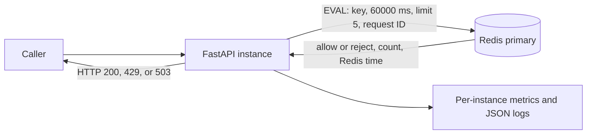

# Distributed API Rate Limiter — Systems Lab

This file is the **raw project notebook**, not a website article. It keeps the
development order, commands, Redis state, tests, measured results, decisions
from our conversations, mistakes, and unresolved work. Use it as source
material when writing the article yourself. All project documentation stays in
this one file.

## As-built map

| Artifact | What is actually there |
|---|---|
| `app/main.py` | FastAPI endpoints and visible Redis commands/Lua scripts |
| `docker-compose.yml` | API, Redis, optional second API, tests, and isolated Redis labs |
| `scripts/load_test.py` | Concurrent HTTP load generator |
| `tests/` | Fake-Redis behavior checks and real-Redis integration tests |
| `.github/workflows/tests.yml` | CI definition; not yet observed running on GitHub |
| `README.md` | Commands to start and test the local system |

Current endpoints: `/counter` (raw `INCR`), `/demo` (intentionally unsafe
`INCR` + `EXPIRE`), `/demo-atomic` (fixed-window Lua), `/demo-sliding`
(primary exact rolling quota), `/demo-token` (burst-friendly comparison),
and `/metrics`. The system runs locally in Docker Compose; no public API is
deployed.

### Actual HTTP behavior

Every limiter endpoint requires `X-Client-ID`; a missing header returns 400.
The header is a teaching identity, not authentication. The constants in
`app/main.py` are five requests/tokens, a 60-second interval, and a token
refill period of 12 seconds. They are not per-client configuration.

| Route | Success body/state | Limit/failure behavior |
|---|---|---|
| `GET /counter` | Returns `client_id`, Redis key, and growing `count`. | No rate limit or TTL; Redis error returns 503. |
| `GET /demo` | Fixed-window count and remaining slots. | Sixth attempt returns 429; learning-only failure header can return 500 after `INCR` but before `EXPIRE`. |
| `GET /demo-atomic` | Same five/60 behavior using one Lua script. | Sixth attempt returns 429; Redis error returns 503. |
| `GET /demo-sliding` | Count of accepted requests in preceding 60 seconds, remaining slots, Redis time. | Sixth accepted-window attempt returns 429; dependency error or deadline returns 503. |
| `GET /demo-token` | Whole tokens remaining, integer credit, Redis time. | Empty bucket returns 429 with `Retry-After` and `retry_after_ms`; dependency failure returns 503. |
| `GET /metrics` | Prometheus text for HTTP, decision, and Redis-operation counters/histograms. | Process-local data; this route does not require a client ID. |

The default Redis connection, socket, and whole-operation timeouts are 200 ms,
200 ms, and 250 ms respectively. Redis retry count is zero. The timeout covers
the dependency operation inside the handler, not the whole HTTP lifecycle.

### Actual Redis key inventory

| Key pattern | Redis type and stored value | Expiration and update rule |
|---|---|---|
| `experiment:counter:{client}` | String integer, e.g. `"2"`. | No TTL. `INCR` records every call. |
| `rate_limit:fixed:{client}` | String integer attempt count. | `EXPIRE 60` only when `INCR` returns 1; the crash gap can leave TTL `-1`. Rejections still increment. |
| `rate_limit:fixed:atomic:{client}` | String integer attempt count. | First Lua increment sets 60-second TTL. Rejections still increment. |
| `rate_limit:sliding:{client}` | Sorted set of accepted request-ID members, scored by Redis Unix milliseconds. | Old scores are removed each request; allowed requests add one member and set `PEXPIRE 60000`. Rejections add nothing. |
| `rate_limit:token:{client}` | Hash fields `credit` and `last_ms`, both integer strings. | Each attempt refills credit from elapsed Redis time, conditionally consumes 12,000 credit, writes both fields, and refreshes `PEXPIRE 60000`. |

Only the relevant endpoint touches each key family. A key's TTL is cleanup for
the sliding log and token bucket; the timestamps/credit calculation make the
actual policy decision. Redis values are strings at the protocol level even
when commands interpret them as integers.

## Decisions and corrections from our conversations

These entries record the choices we made and why. The increment notes below
hold the implementation and experiment detail.

1. **Build to learn.** You wanted small runnable increments, raw Redis
   commands, `redis-cli` inspection, and predictions before major choices. We
   started with a counter, not a complete limiter. We chose `X-Client-ID` so
   one developer could simulate several clients. This header is untrusted and
   unsuitable as a production identity without authentication.
2. **One documentation file.** You asked for all HLD, LLD, experiments, lessons,
   and eventual article source in this file. I initially added a polished
   website section; you clarified that you need raw material and will write
   the article yourself. That section was removed.
3. **First limiter: five per 60 seconds.** You selected this observable limit
   and predicted the `INCR`/`EXPIRE` crash correctly: the counter would have no
   expiry. We kept the unsafe endpoint so the failure remains reproducible.
4. **Lua atomicity.** You initially expected a failed Lua script to roll back
   its writes. Redis does not do that. The guarantee we use is no interleaving
   by other clients while the script runs; earlier script writes may survive a
   later runtime error. A lost HTTP response can also leave the caller unsure
   whether the script committed.
5. **Algorithm choice.** We compared a fixed window, an exact sliding log,
   and an approximate sliding-window counter. You chose the exact log because
   the primary requirement is *at most five accepted requests in any rolling
   60 seconds*. Later you chose sliding log over token bucket for that strict
   promise. The token bucket remains an implemented alternative: burst of five,
   refill one every 12 seconds. Leaky bucket was discussed as a smoothing/
   queueing design but was not implemented.
6. **API instances.** We clarified that an instance is one running FastAPI
   process/container with its own Python memory. You initially deferred the
   two-instance proof; later we ran it locally. Both instances shared Redis,
   yielding five allowed requests and one rejection across ports 8000/8001.
7. **Redis failure policy.** You reasoned that fail-open or fail-closed depends
   on the application. We refined that to the consequence of bypassing the
   limit versus denying legitimate traffic, then chose fail-closed for this
   demo. Redis errors and timeouts return HTTP 503. Automatic client retries
   and a 200 ms socket timeout did not bound whole-call latency: observed
   outage calls took 7.83 s and 8.22 s. An async 250 ms application deadline
   reduced the observed outage response to 0.212 s. DNS/service discovery was
   a plausible source of the earlier delay, not conclusively isolated.
8. **Observability.** You agreed not to put `client_id` in Prometheus labels:
   millions of IDs would create too many metric series. It remains in JSON
   decision logs. Metrics are per API process and reset on restart.
9. **Load-test surprise.** We expected 5 allowed and 95 rejected for one
   client. At concurrency 10 that happened. At concurrency 100, 94 callers
   received 503 and 6 received 429, yet Redis held exactly five events. A
   timeout is an *unknown outcome*, not proof that Redis rolled back.
10. **Persistence.** You judged a fresh quota after Redis loses temporary
    state acceptable for this project. Isolated labs showed no-persistence
    lost its key after restart, while forced RDB and fsynced AOF recovered
    theirs. The main Redis now explicitly has both persistence modes off.
11. **Eviction.** You initially preferred LRU. The lab evicted 18,926 keys and
    a still-live rate-limit key, which would silently reset a quota. We
    changed to `noeviction` for consistency with fail-closed behavior. Main
    Redis has a 64 MiB teaching limit, not a production capacity target.
12. **Replication.** We clarified stale data: a replica may be behind a
    primary. The manual lab replicated one increment and promoted the replica
    successfully. It did not reproduce a lost write or provide automatic
    failover. Replica lag remains a possible quota-reset failure mode.
13. **Deployment scope.** The original project idea included a public
    deployment. You changed this to source on GitHub and an article on your
    personal website. GitHub Pages can host static article content but cannot
    run FastAPI or Redis. We will describe the system as *locally
    reproducible*, not publicly deployed.
14. **Verification scope.** The local nine-test suite passes, including
    real-Redis tests for sliding log and token bucket. The GitHub Actions file
    exists, but a hosted run has not yet been observed. You chose
    `https://github.com/payasvaishnav/syslab-distributed-rate-limiter` as the
    source repository; the first `main` push succeeded.

### Environment and test-harness notes from the build

- The first `docker compose up --build` failed because Docker Desktop's Linux
  engine pipe was absent. Starting Docker Desktop and checking that
  `docker version` had both Client and Server sections resolved the setup
  issue; it was not a Redis-image or application bug.
- An image rebuild once failed to resolve Docker Hub's authentication host.
  We used the existing image with a bind-mounted `app/` directory to keep
  iterating, then rebuilt successfully when the network recovered.
- An early containerized pytest run could not import `app`. Setting the
  project root on Python's import path worked; `pytest.ini` now makes that
  path explicit for normal test runs.
- The first token-bucket integration test hit `Event loop is closed` because
  a module-level async Redis client held connections from a previous
  `TestClient` loop. The concurrent test now creates and closes its own async
  Redis client in one loop. This was test isolation, not a Lua failure.
- A persistence run using ten-minute TTLs became inconclusive during a long
  tooling delay: all keys expired. We repeated it with non-expiring lab keys
  before claiming a restart result.

## Open items and honesty checks

- The directory was not a Git repository at the earlier check. It has now been
  initialized locally and pushed to the chosen GitHub repository. A hosted CI
  run has not yet been observed.
- No public API deployment, dashboard, automatic failover, request-ID
  deduplication, trusted client identity, or multi-region consistency exists.
- Load-test throughput is from a short local run. It is not a production
  capacity claim.
- A 250 ms Redis-operation deadline does not bound the entire HTTP request.
- Main Redis keys are disposable and reset when that container is recreated.

## Chronological implementation and experiment log

## Increment 0 — Redis counter connectivity

### Goal

Prove that a FastAPI process can use Redis as shared state before calling that
state a rate limiter. `GET /counter` requires an `X-Client-ID` header and
increments a counter for that client.

### Redis command

```text
INCR experiment:counter:alice
```

`INCR` parses the value stored at the key as an integer, adds one, stores the
new integer, and returns it. When the key does not exist, Redis treats it as
zero first. The stored Redis value is a string representing that integer, for
example `"3"`.

`INCR` is atomic: Redis executes each command indivisibly, so two simultaneous
requests cannot both receive the same incremented value or overwrite one
another's update. This first increment deliberately sets no TTL and enforces no
limit, so counters persist until manually deleted or Redis data is cleared.

### Questions to answer by running it

1. After two requests from `alice`, what exact value will `GET experiment:counter:alice` return?
2. What will `TTL experiment:counter:alice` return when we have not set an expiry?
3. If two API containers use the same Redis instance, do they observe one shared counter?

### Commands to run after startup

```powershell
docker compose up --build
curl.exe -H "X-Client-ID: alice" http://localhost:8000/counter
curl.exe -H "X-Client-ID: alice" http://localhost:8000/counter
docker compose exec redis redis-cli GET experiment:counter:alice
docker compose exec redis redis-cli TTL experiment:counter:alice
```

Expected initial learning point: `GET` should show `2`; `TTL` should show `-1`,
meaning the key exists but has no expiration. We will intentionally turn this
property into a problem in the next increment, when a rate-limit counter needs
to expire.

## Increment 1 — First fixed-window limiter (intentionally unsafe)

### Behavior

`GET /demo` accepts `X-Client-ID` and allows at most five requests over a
60-second window that begins with that client's first request. The sixth request
receives HTTP 429.

For `alice`, the first request issues these Redis commands in order:

```text
INCR rate_limit:fixed:alice       -> 1
EXPIRE rate_limit:fixed:alice 60  -> 1
```

Afterward, Redis contains:

```text
rate_limit:fixed:alice  =>  "1"
TTL                     =>  about 60 seconds
```

Later requests run only `INCR`; the key's remaining TTL continues to count down.
`EXPIRE` returns `1` when it successfully sets the expiration. Redis deletes the
key automatically after its TTL reaches zero.

### Atomicity and the intentional flaw

Each command is atomic by itself. Concurrent `INCR` calls produce distinct,
correct counts: one request receives `1`, another `2`, and so on. But the pair
of commands is not atomic. Redis can process another request—or the API can
crash—between `INCR` and `EXPIRE`.

If the API crashes after a first `INCR` but before `EXPIRE`, the key remains as
`"1"` with TTL `-1`. Future requests increment that permanent key and, because
their returned count is not `1`, they never set an expiry. Once the count passes
five, the client can be rate-limited indefinitely. We will reproduce this exact
failure before replacing these commands with a Lua script.

### Inspect it

```powershell
curl.exe -H "X-Client-ID: alice" http://localhost:8000/demo
docker compose exec redis redis-cli GET rate_limit:fixed:alice
docker compose exec redis redis-cli TTL rate_limit:fixed:alice
```

Run the request five more times. The fifth total request is allowed; the sixth
is rejected, but it still increments the stored counter. This is useful: the
counter records attempted requests, not merely allowed requests.

## Increment 2 — Reproduce the `INCR` / `EXPIRE` crash gap

### Fault injection

For this learning experiment only, `/demo` accepts the header
`X-Simulate-Failure-After-Incr: true`. It returns HTTP 500 after `INCR` succeeds
but before the code calls `EXPIRE`. It does not crash the container; it models
the important outcome of an actual process crash: no expiry command reaches
Redis. Do not carry a feature like this into a production API.

Run this using a new client ID, so an existing expiry cannot hide the result:

```powershell
curl.exe -i -H "X-Client-ID: crash-case" -H "X-Simulate-Failure-After-Incr: true" http://localhost:8000/demo
docker compose exec redis redis-cli GET rate_limit:fixed:crash-case
docker compose exec redis redis-cli TTL rate_limit:fixed:crash-case
```

Expected Redis state:

```text
rate_limit:fixed:crash-case  =>  "1"
TTL                          =>  -1
```

Send a normal request next:

```powershell
curl.exe -H "X-Client-ID: crash-case" http://localhost:8000/demo
docker compose exec redis redis-cli TTL rate_limit:fixed:crash-case
```

The normal request receives count `2`, but the TTL remains `-1`. Our code sets
an expiry only when `INCR` returns `1`; that opportunity was lost. After four
more normal requests, the client will be rejected forever, or until somebody
deletes the key / Redis loses its data. The cleanup command for this experiment
is:

```powershell
docker compose exec redis redis-cli DEL rate_limit:fixed:crash-case
```

### Conclusion

The issue is not lost increments: Redis `INCR` remains atomic under concurrency.
The issue is that a correctness rule—"a new counter must always receive a
TTL"—spans two separate commands. The next increment will move both actions
into one Redis Lua script, which Redis executes atomically.

## Increment 3 — Atomic fixed-window limiter with Lua

### First misconception corrected: atomicity is not rollback

Redis runs a Lua script without interleaving commands from other clients. That
is the useful atomicity guarantee here. However, if a script mutates data and
then raises a runtime error, Redis does **not** roll back the earlier mutation.
Lua scripts are not database transactions with rollback.

Our script therefore stays deliberately small and performs no error-prone work
after it begins mutating the key:

```lua
local count = redis.call('INCR', KEYS[1])
if count == 1 then
    redis.call('EXPIRE', KEYS[1], ARGV[1])
end
return count
```

The API executes it as the equivalent of:

```text
EVAL <script> 1 rate_limit:fixed:atomic:alice 60
```

`1` tells Redis that one following argument is a key. Therefore:

```text
KEYS[1] = rate_limit:fixed:atomic:alice
ARGV[1] = 60
```

Keys must be passed through `KEYS`, rather than hidden in script text or
`ARGV`. This becomes operationally important with Redis Cluster, which uses the
declared keys to determine their hash slots.

### Why this closes the crash gap

Redis finishes the entire script before running another client's command. If
the key is new, `INCR` and the conditional `EXPIRE` execute together from the
perspective of every other client. If the API process disconnects after sending
`EVAL`, Redis continues executing the script; an API crash cannot occur inside
Redis between these two calls.

After Alice's first atomic request, the exact state is:

```text
rate_limit:fixed:atomic:alice  =>  "1"
TTL                            =>  about 60 seconds
```

This does not provide exactly-once request processing. If Redis finishes the
script but the API crashes before receiving the response, a retry increments
the counter again. Fixing that requires request IDs and deduplication state,
which is a different tradeoff from atomic counter updates.

### Inspect the atomic version

```powershell
curl.exe -H "X-Client-ID: alice" http://localhost:8000/demo-atomic
docker compose exec redis redis-cli GET rate_limit:fixed:atomic:alice
docker compose exec redis redis-cli TTL rate_limit:fixed:atomic:alice
```

The old `/demo` endpoint remains available so the unsafe and atomic versions
can be compared directly. The same five-request limit applies to each endpoint,
but they use separate Redis keys.

## Increment 4 — Exact sliding-window log

### Why fixed windows permit bursts

With a limit of five, a client can make five requests near the end of one
window and five more immediately after the counter expires. Ten requests can
therefore pass in a very short interval. The fixed-window implementation is
cheap—one string key per active client—but it is inaccurate at boundaries.

The `/demo-sliding` endpoint instead asks: "How many accepted requests did this
client make during the preceding 60 seconds from right now?" It stores those
request events in a Redis sorted set.

### Exact Redis data

The key for Alice is:

```text
rate_limit:sliding:alice
```

Its type is a sorted set (`zset`). Every accepted request creates one entry:

```text
member = unique request ID, such as 4e78...f912
score  = Redis time in Unix milliseconds, such as 1790672400123
```

The unique member matters because sorted-set members are unique. If the
timestamp were also the member, simultaneous requests in the same millisecond
could overwrite one another and be undercounted.

### Atomic Lua algorithm

For every request, one script performs:

```text
TIME
ZREMRANGEBYSCORE key -inf cutoff
ZCARD key
ZADD key timestamp request_id    (only when below the limit)
PEXPIRE key 60000                (only when allowed)
```

- `TIME` reads Redis's clock. All API instances therefore use one time source;
  skew between application hosts cannot change rate-limit decisions.
- `ZREMRANGEBYSCORE` removes entries whose scores are at or before
  `now - 60 seconds`.
- `ZCARD` returns the number of entries still inside the window.
- `ZADD` adds the unique request event with its timestamp as the sortable score.
- `PEXPIRE` sets key lifetime in milliseconds. Refreshing it after an allowed
  request keeps the key only while it can still contain relevant events.

The script rejects when `ZCARD` is already five. Rejected requests are not
stored, preventing sustained rejected traffic from growing the sorted set.
Because the whole sequence is one Lua execution, concurrent requests cannot
both inspect a count of four and both admit themselves: one script completes
its `ZADD` before the next script performs `ZCARD`.

### Inspect it

```powershell
curl.exe -H "X-Client-ID: alice" http://localhost:8000/demo-sliding
docker compose exec redis redis-cli TYPE rate_limit:sliding:alice
docker compose exec redis redis-cli ZRANGE rate_limit:sliding:alice 0 -1 WITHSCORES
docker compose exec redis redis-cli ZCARD rate_limit:sliding:alice
docker compose exec redis redis-cli PTTL rate_limit:sliding:alice
```

`ZRANGE ... WITHSCORES` shows the request IDs and timestamps. `ZCARD` shows how
many accepted events remain. `PTTL` shows the remaining lifetime in
milliseconds. After 60 seconds without an accepted request, the whole key can
be deleted because all its entries are too old to influence a decision.

### Tradeoff

The fixed window uses roughly constant memory and constant-time counter work per
client. The exact sliding log stores up to `limit` entries per active client and
must remove old entries; its cost grows with the configured limit and traffic.
It is appropriate for this small system and for strict low-to-moderate limits.
At very high scale, an approximate sliding-window counter, token bucket, or
purpose-built gateway may offer a better accuracy/cost balance.

## Increment 5 — Redis failure policy and timeouts

### Decision: fail closed

Protected endpoints return HTTP 503 when Redis cannot make a trustworthy rate
limit decision. They do not forward the request as though it were allowed. The
response includes `Retry-After: 1` and identifies the policy as `closed`.

"Mission critical" does not automatically imply fail-closed. The decision
depends on which failure is worse. Login-abuse protection or an expensive API
may prefer rejecting traffic over losing enforcement. Emergency information
or low-risk cached content may prefer fail-open availability. This learning
service chooses enforcement consistency.

### Bounded waiting

The Redis client uses two separate 200 ms limits:

```text
socket_connect_timeout = 0.2 seconds
socket_timeout         = 0.2 seconds
```

The connect timeout limits how long establishing a Redis connection may take.
The socket timeout limits how long an established connection may wait for a
response. Without bounded timeouts, fail-closed can degrade into requests that
hang until much slower operating-system network timeouts expire.

The request-path client also disables automatic retries. A retry policy needs a
total latency budget; otherwise several individually short attempts plus
backoff can still violate the API deadline.

Most importantly, each API handler wraps its complete Redis operation in a
250 ms asynchronous application deadline. This is broader than a socket
timeout: it bounds service discovery/DNS, connection establishment, retries,
and command response as one request-path budget. The handlers use redis-py's
async client so FastAPI can cancel the pending operation when that deadline is
exceeded.

These values are starting points, not universal production settings. A real
value should be chosen from the API latency budget and observed Redis latency,
with enough headroom to avoid rejecting healthy tail-latency requests.

### Unavailable-Redis experiment

Keep the API running, stop only Redis, then call a protected endpoint:

```powershell
docker compose stop redis
curl.exe -i -H "X-Client-ID: failure-test" http://localhost:8000/demo-sliding
docker compose start redis
```

Expected result: HTTP 503 rather than an allowed request. No new rate-limit
state can be written while Redis is unavailable. Starting Redis again restores
decisions; whether prior keys survive depends on Redis persistence, which we
will examine separately.

#### First result and correction

The first outage run returned the correct 503 but took **7.83 seconds**. We
initially suspected retry backoff and disabled redis-py retries. A second run
still took **8.22 seconds**; inspecting the live client confirmed zero retries.
The remaining delay occurred outside the command retry loop, consistent with
Docker service discovery/name resolution for the stopped `redis` hostname.

This corrected a deeper misconception: a socket/connect timeout does not
necessarily bound the complete dependency call. We changed the FastAPI
handlers to use redis-py's async client and wrapped the whole Redis operation in
a 250 ms application deadline. The final experiment below records whether that
end-to-end bound holds.

The third outage run returned HTTP 503 in **0.212 seconds**. This is within the
250 ms Redis operation budget (the small difference includes HTTP handling and
measurement overhead). The experiment demonstrates why dependency deadlines
should be measured at the application boundary rather than inferred from a
low-level socket setting.

### Slow-Redis experiment

Redis `CLIENT PAUSE` can temporarily delay command processing in this local
learning environment:

```powershell
docker compose exec redis redis-cli CLIENT PAUSE 1000 ALL
curl.exe -i -H "X-Client-ID: slow-test" http://localhost:8000/demo-sliding
```

The one-second pause exceeds the 200 ms socket timeout, so the API should return
503 promptly. This command affects the entire local Redis instance; it is a
failure-injection tool here, not an action to casually run against production.

### Remaining limitation

Fail-closed makes Redis part of the request availability path. Replication and
failover can reduce downtime, but they cannot guarantee zero interruption or
zero lost increments. We will revisit that when examining Redis operations.

## Increment 6 — Metrics and structured logs

### Metrics endpoint

`GET /metrics` exposes Prometheus text containing:

```text
http_requests_total{method,endpoint,status}
http_request_duration_seconds{method,endpoint}
rate_limit_decisions_total{algorithm,outcome}
redis_operation_duration_seconds{operation,outcome}
```

Counters answer how many requests or decisions occurred. Histograms place
latency observations into fixed buckets so a metrics backend can calculate
rates and approximate percentiles across many observations and instances.

These metrics live in the API process: they reset when that process restarts,
and each API instance has its own values. In a deployed system, Prometheus (or a
compatible collector) scrapes every instance and stores/aggregates the series
outside the application.

The labels are intentionally bounded. `endpoint`, `status`, `algorithm`, and
`outcome` each have a small known set of possible values. `client_id` and
`request_id` are never metric labels: millions of clients would create millions
of time series, consuming monitoring memory and making queries expensive. This
is the high-cardinality label problem.

Inspect the metrics after making allowed and rejected requests:

```powershell
curl.exe -H "X-Client-ID: metrics-test" http://localhost:8000/demo-sliding
curl.exe http://localhost:8000/metrics
```

### Structured decision logs

Every sliding-log decision writes one JSON object. A successful record resembles:

```json
{"timestamp":"...","event":"rate_limit_decision","client_id":"metrics-test","request_id":"...","algorithm":"sliding_log","outcome":"allowed","requests_in_window":1,"redis_duration_ms":1.2}
```

Unlike metrics, logs may contain identifiers because they are event records,
not permanent dimensions multiplied into time series. In a serious system,
client identifiers may still be sensitive and should be hashed, access
controlled, or omitted according to privacy and retention requirements.

View the live API logs with:

```powershell
docker compose logs -f api
```

Metrics tell us the aggregate health and alerting story; structured logs let us
investigate individual decisions. Neither replaces distributed tracing when a
request crosses several services.

## Increment 7 — Concurrent load testing

### Tool and method

`scripts/load_test.py` uses an asynchronous `httpx` client and a semaphore to
control concurrency. It reports status-code counts, total throughput, and
nearest-rank p50/p95/p99/max client-observed latency.

Two modes answer different questions:

- `shared` sends every request with one fresh client ID. With 100 concurrent
  requests, exactly five should receive 200 and 95 should receive 429. This is
  primarily a concurrency-correctness test.
- `unique` creates a fresh client ID per request. All requests should be allowed;
  this exercises API/Redis throughput without one client's quota dominating
  the result. It also creates one temporary Redis key per request.

Run either experiment from the Docker network:

```powershell
docker compose run --rm api python scripts/load_test.py --url http://api:8000/demo-sliding --requests 100 --concurrency 100 --client-mode shared
docker compose run --rm api python scripts/load_test.py --url http://api:8000/demo-sliding --requests 100 --concurrency 100 --client-mode unique
```

These are local development measurements, not universal capacity claims. The
machine, Docker networking, JSON logging, Redis configuration, client location,
warm-up state, and sample size all influence the results.

### Results

Measured locally against one Uvicorn process and one Redis container:

| Mode | Requests / concurrency | HTTP results | Throughput | p50 | p95 | p99 |
|---|---:|---|---:|---:|---:|---:|
| shared, overload burst | 100 / 100 | 6×429, 94×503 | 67.99 req/s | 997.5 ms | 1196.2 ms | 1221.8 ms |
| shared, controlled | 100 / 10 | 5×200, 95×429 | 107.18 req/s | 62.0 ms | 93.4 ms | 630.8 ms |
| unique, controlled | 100 / 10 | 100×200 | 130.25 req/s | 43.5 ms | 119.5 ms | 365.0 ms |

The 100-way burst exposed a capacity boundary rather than the expected clean
5/95 HTTP split. Structured logs showed dependency timeouts around 251–255 ms,
just beyond the 250 ms Redis-operation deadline. Redis still contained exactly
five sorted-set entries for the shared client. Some scripts therefore committed
an allowed event, but their API callers timed out before receiving the result.

This is another distributed-systems lesson: a timeout means the caller does not
know the outcome; it does not prove the operation failed. Our limiter stayed
conservative—uncertain calls returned 503—and the Redis state never admitted
more than five requests. At concurrency 10, clients observed the expected five
200 responses and 95 rejections.

The HTTP p99 values can exceed the 250 ms Redis deadline because they measure
the whole request, including connection scheduling, application/event-loop
queueing, JSON/access logging, and response handling. The deadline bounds the
Redis await after the handler begins that operation, not total HTTP latency.

The unique-client run reached about 130 requests/second on this local setup and
allowed all requests. That number is a baseline for comparing future changes,
not a production capacity estimate. Larger tests require warm-up runs, multiple
samples, CPU/memory monitoring, controlled logging, a remote load generator,
and enough duration to reach steady state.

## Increment 8 — Memory limits and eviction

### Isolated Redis laboratory

Memory experiments use the optional `redis-lab` Compose service on host port
6380. It is separate from the API's Redis instance, has no persistence, and is
configured with a deliberately small 4 MiB memory limit:

```text
maxmemory 4mb
maxmemory-policy allkeys-lru
```

Start it without touching application state:

```powershell
docker compose --profile lab up -d redis-lab
docker compose exec redis-lab redis-cli CONFIG GET maxmemory
docker compose exec redis-lab redis-cli CONFIG GET maxmemory-policy
```

### LRU behavior

`allkeys-lru` allows writes after the memory limit is reached by evicting keys
that Redis estimates were least recently used. Redis uses sampling rather than
maintaining a perfectly ordered global LRU list, so the choice is approximate.

For rate limiting, an evicted key is a forgotten history. That client receives
a fresh quota. This keeps Redis writable and favors service availability, but
it weakens enforcement under memory pressure.

Useful observations are:

```text
INFO memory  -> used_memory and maxmemory
INFO stats   -> evicted_keys
DBSIZE       -> current key count
```

### `noeviction` comparison

With `maxmemory-policy noeviction`, Redis preserves existing keys but returns an
OOM error for commands that would allocate more memory. Our API treats such a
Redis error as an unavailable rate-limit decision and returns 503, matching its
fail-closed policy.

There is no universally safe choice:

- LRU preserves availability while silently resetting some quotas.
- `noeviction` preserves known quota state while rejecting traffic that needs a
  write.

For this project's fail-closed design, `noeviction` is the more internally
consistent deployment choice. The LRU lab remains useful for understanding why
an eviction policy is part of application correctness, not just Redis tuning.

### Measured results

The isolated instance began at roughly 988 KiB of logical Redis memory under a
4 MiB limit. We inserted a sorted-set rate-limit key with a ten-minute TTL, then
used `redis-benchmark` to attempt 20,000 random 1 KiB writes.

Under `allkeys-lru`:

```text
evicted_keys: 18926
remaining keys: 895
rate-limit key exists: 0
```

The rate-limit key was evicted before its TTL elapsed. This proves that a TTL
does not protect a key from a memory-policy eviction.

We then flushed only the disposable lab database, changed its runtime policy to
`noeviction`, reset statistics, recreated the representative rate-limit key,
and repeated the fill. Redis returned:

```text
OOM command not allowed when used memory > 'maxmemory'.
```

The existing rate-limit key still existed and the database held 916 keys. A
later tiny write could fit, which illustrates that hitting `maxmemory` is not a
permanent binary state: whether a command requires enough additional memory to
be rejected depends on current allocations and the command's size.

The experiment changes our deployment choice from the initial LRU preference
to `noeviction`, because silent quota resets conflict with the explicit
fail-closed requirement. Capacity alerts must fire well before the limit;
`noeviction` is a last-resort correctness behavior, not normal flow control.

## Increment 9 — Redis persistence

Three isolated Compose services make recovery behavior visible:

| Service | Host port | Persistence | Storage |
|---|---:|---|---|
| `redis-lab` | 6380 | none | container memory only |
| `redis-rdb-lab` | 6381 | RDB snapshots | named volume |
| `redis-aof-lab` | 6382 | AOF, fsync every second | named volume |

### No persistence

With both RDB and AOF disabled, a Redis process restart loses every key. This is
acceptable for this demo's 60-second quotas, with the documented consequence
that clients receive fresh capacity after recovery.

### RDB

RDB creates a compact point-in-time snapshot of the dataset. Forking and
writing snapshots has operational cost, and changes made after the most recent
successful snapshot can be lost. The lab uses `SAVE` to force a deterministic
snapshot before restart; normal production snapshots are usually backgrounded
and schedule-driven.

Useful commands:

```text
SAVE       synchronously write a snapshot (blocking; lab use here)
BGSAVE     request a background snapshot
LASTSAVE   return the last successful snapshot time
```

### AOF

Append-only file persistence records write operations. With `appendfsync
everysec`, Redis normally asks the operating system to flush AOF data about once
per second, trading a small potential loss window for better throughput than
fsyncing every command. `WAITAOF 1 0 2000` lets our test wait for one local AOF
fsync before restarting.

AOF files grow and need rewriting/compaction. AOF generally improves recovery
recency compared with periodic RDB snapshots, but adds disk I/O, storage, and
recovery complexity. Neither mode turns Redis replication into strong
consistency, nor guarantees that an acknowledged write survives every machine
or storage failure.

### Project decision

The deployed learning limiter may use no persistence because all quota state is
short-lived. A stricter abuse-prevention or billing quota would need durable
state, a carefully chosen AOF/RDB policy, and possibly a different source of
truth. Persistence requirements follow the consequence of losing a counter,
not a blanket rule that Redis must always be durable.

### Measured recovery results

The first attempt used ten-minute TTLs, but the keys expired during an unrelated
tooling delay, making that run inconclusive. We repeated the restart experiment
with non-expiring disposable keys so elapsed time could not masquerade as data
loss.

Before restart:

```text
redis-lab      persistence:restart-test = no-persistence
redis-rdb-lab  persistence:restart-test = rdb       (then SAVE)
redis-aof-lab  persistence:restart-test = aof       (then WAITAOF)
```

After restarting all Redis processes:

```text
no persistence -> nil
RDB             -> "rdb"
AOF             -> "aof"
```

We then force-recreated the RDB and AOF containers. Both values survived because
their `/data` directories live in named Docker volumes. This separates two
ideas that are easy to conflate: Redis must write durable files, and those files
must themselves live on storage that survives process/container replacement.

## Increment 10 — Replication and manual failover

The `replication` Compose profile contains an isolated primary and one replica.
Neither is used by the API. The replica follows the primary with `--replicaof`.

```powershell
docker compose --profile replication up -d redis-primary-lab redis-replica-lab
docker compose exec redis-primary-lab redis-cli INFO replication
docker compose exec redis-replica-lab redis-cli INFO replication
```

`INFO replication` should report `role:master` on the primary and `role:slave`
with `master_link_status:up` on the replica. Redis still uses the word `slave`
in some protocol fields. The primary accepts writes and streams them to the
replica; the replica serves read-only queries by default.

For a disposable test key, `INCR` on the primary should eventually appear in a
`GET` on the replica. `WAIT 1 1000` on the *same primary client connection* as
the write can wait for one replica to acknowledge receiving preceding writes.
It does not make the write durable or turn the system into a consensus database.

If the primary disappears, this Compose setup does not automatically promote a
replica or redirect the API. An operator can issue `REPLICAOF NO ONE` to promote
the replica. The API would still need discovery or configuration changes to use
the promoted node. The gap between an acknowledged primary write and replica
receipt can mean a promoted replica has stale rate-limit state and grants extra
quota. Even `WAIT` narrows that window rather than guaranteeing zero data loss.

The experiment below records only behavior actually observed in the isolated
pair; reliably reproducing a lost write requires more controlled fault
injection than simply stopping a container after an ordinary command.

### Observed lab result

The primary reported `role:master` with one connected replica. The replica
reported `role:slave`, `master_link_status:up`, and `slave_read_only:1`. After
`INCR replication:counter` returned `1` on the primary, `GET` on the replica
returned `"1"`.

We stopped only `redis-primary-lab`, ran `REPLICAOF NO ONE` on the replica, and
then ran `INCR replication:counter` there. It returned `2`, confirming manual
promotion and continued writes. This run showed no lost write because the
replica had already received the first increment. It does **not** prove that
every acknowledged primary write will survive a real failover.

This is a manual lab, not an automatic high-availability system. Starting the
old primary again without reconciliation could create two writable primaries.
Production failover needs coordination, fencing, and client redirection (for
example a managed Redis service or carefully configured Sentinel), plus an
explicit tolerance for replication lag.

## Increment 11 — Two API instances, one quota

Start a second copy of FastAPI on port 8001. Both containers use
`redis://redis:6379/0`; the `multi` profile leaves the normal one-instance
startup unchanged.

```powershell
docker compose --profile multi up -d --build api api-second
```

Use a fresh client ID and alternate ports:

```powershell
$clientId = "multi-$(Get-Random)"
1..6 | ForEach-Object {
    $port = if ($_ % 2 -eq 1) { 8000 } else { 8001 }
    curl.exe -s -o NUL -w "%{http_code}`n" -H "X-Client-ID: $clientId" "http://localhost:$port/demo-sliding"
}
docker compose exec redis redis-cli ZCARD "rate_limit:sliding:$clientId"
```

Expected statuses are five `200`s followed by one `429`, and `ZCARD` should
return `5`. The processes have separate Python memory and separate `/metrics`
counters. The quota remains global because each Lua script reads and changes
the same Redis sorted set. This local test proves shared state across instances;
it does not measure load-balancer behavior or public deployment.

The portfolio scope is a reproducible local system published as source code and
a website article. GitHub Pages may host the static article; it cannot run the
FastAPI and Redis services. The write-up will say explicitly that no public API
deployment was performed.

### Observed result

With fresh client ID `multi-c3cc3f61`, we sent requests alternately to ports
8000 and 8001. The six HTTP statuses were `200, 200, 200, 200, 200, 429`.
`ZCARD rate_limit:sliding:multi-c3cc3f61` returned `5`. This confirms both API
containers consumed the same Redis-backed quota. The initial `--no-build` start
failed because the new service had no image tag yet; building `api-second` and
starting the profile resolved it. New users can run the documented `--build`
command directly.

## Increment 12 — Repository verification

`tests/test_redis_integration.py` sends six requests through the FastAPI app
against a real Redis server. It checks the five allowed/one rejected result,
sorted-set type, five unique members, and a positive TTL. A random client ID
isolates the test; its key is deleted afterward. The earlier fake-client tests
remain fast checks for application branches and failure behavior.

Run the full suite locally with `docker compose --profile test run --rm --build
tests`. GitHub Actions starts a Redis service and runs the same suite on pushes
and pull requests. CI uses a two-second Redis operation deadline to avoid
confusing shared-runner scheduling noise with the 250 ms timeout policy measured
in our local failure experiments. The live API still uses 250 ms by default.

The local Docker test run passed all eight tests, including the real-Redis
integration test. GitHub Actions itself has not run yet because the project has
not been pushed to a GitHub repository; a green local run is evidence for the
code and configuration, not a claim about a future hosted CI run.

## Increment 13 — Token bucket and system-design comparison

The token bucket permits a short burst while enforcing a longer-term refill
rate. Our bucket holds five tokens and refills one token every 12 seconds. If a
client spends all five, waits 24 seconds, and sends three requests immediately,
two are allowed and the third is rejected. A rejection does not consume credit.

### Exact Redis state

For Alice, `rate_limit:token:alice` is a **hash** with two string fields:

```text
credit  = "48000"
last_ms = "<Redis Unix time in milliseconds>"
PTTL    = about 60000 milliseconds
```

One token costs 12,000 integer credits; Redis time refills one credit per
millisecond. A new bucket begins with 60,000 credits, so the first accepted
request leaves 48,000. Integers avoid storing fractional tokens. The key expires
after 60 seconds without another request, at which point a new request can
start with a full bucket. Rejected requests refresh the TTL but add no entries,
so one active client still uses one fixed-size hash.

Inspect it:

```powershell
curl.exe -H "X-Client-ID: alice" http://localhost:8000/demo-token
docker compose exec redis redis-cli TYPE rate_limit:token:alice
docker compose exec redis redis-cli HGETALL rate_limit:token:alice
docker compose exec redis redis-cli PTTL rate_limit:token:alice
```

The Lua script uses `TIME`, `HMGET`, integer refill math, conditional consumption,
`HSET`, and `PEXPIRE`. `HMGET` returns the stored credit and timestamp, or nil
values for a new key. `HSET` writes both fields. `PEXPIRE` bounds the idle key's
life. Redis runs the whole script without interleaving another request's
script, so concurrent callers cannot all spend the same final token.

### Choosing an algorithm

| Algorithm | What it promises | Per-client Redis state | Good fit |
|---|---|---|---|
| Fixed window | Up to five per anchored 60-second window | One integer string | Cheap coarse limits |
| Sliding log | At most five accepted requests in any preceding 60 seconds | Up to five sorted-set events | Strict rolling quota |
| Token bucket | Burst of five, then one token per 12 seconds | One two-field hash | APIs that tolerate bursts but need average-rate control |

Token bucket can allow a request sooner than sliding log after a burst: once a
token refills, it can be spent even while earlier requests remain inside the
last 60 seconds. That is a policy choice, not a correctness defect. A leaky
bucket usually smooths *processing* with a bounded queue draining at a fixed
rate; implementing queued work, scheduling, and backpressure would be a
different service. We document it without adding an endpoint here.

An initially full token bucket can allow five requests at once and then about
five more over the next 60 seconds as tokens refill. Therefore its setting
does **not** mean "at most five in every rolling minute." The sliding log does
mean that. Token bucket uses constant memory per active client, but a million
distinct active clients still require about a million Redis keys. Redis `TIME`
is a shared wall clock; the script clamps a backward clock step rather than
granting extra credit from a negative elapsed interval.

The local real-Redis test sends ten concurrent requests with one fresh client
ID and checks that exactly five are allowed. It then moves the hash timestamp
back 24 seconds and confirms the next three results are 200, 200, 429.

### Primary design decision

The project requirement for the primary endpoint is **at most five accepted
requests in any rolling 60-second interval per client**. That wording rules out
the fixed-window boundary burst and the token bucket's refill behavior. We
therefore choose `/demo-sliding` as the primary design. `/demo-token` stays as a
comparison for APIs where short bursts are useful and the average rate matters
more than a strict rolling quota.

This choice spends more Redis memory and sorted-set work for a clearer, stricter
promise. At a small five-request limit, each active client's sorted set contains
at most five members. At much larger limits or client populations, memory use
and the cost of removing old entries become part of the capacity calculation.

The complete local suite now passes: nine tests. The first test attempt found a
test-harness issue: a module-level async Redis client retained connections from
an earlier `TestClient` event loop that had closed. Giving the concurrent test
its own client and closing it inside the same loop fixed test isolation. This
does not change the running API's one-loop request model.

A live `/demo-token` request returned `credit: 48000` and four whole tokens
remaining. `HGETALL rate_limit:token:token-live-check` showed exactly
`credit = 48000` and `last_ms = 1790839871273`; a later `PTTL` returned 42491
ms, confirming the key had a 60-second idle expiry rather than no expiry.

## Increment 14 — Request path and scaling model

### One sliding-log request, end to end



1. FastAPI reads `X-Client-ID: alice`. For this teaching system the caller
   chooses the ID; a production service must derive it from a trusted identity
   or authenticate it, otherwise a caller can evade limits by changing headers.
2. The API forms `rate_limit:sliding:alice` and generates a unique request ID.
   It sends one `EVAL` command with the key in `KEYS[1]` and the window, limit,
   and request ID in `ARGV`.
3. Inside Redis, `TIME` supplies one shared clock. `ZREMRANGEBYSCORE` removes
   accepted events at or before `now - 60000 ms`; `ZCARD` counts the survivors.
4. If five remain, the script rejects without adding an entry. Otherwise
   `ZADD` records the new ID with `now_ms` as its score and `PEXPIRE` gives the
   key an idle lifetime. The script returns the decision and count.
5. The API returns HTTP 200 or 429 and records a metric and structured log.
   If the dependency call errors or passes the 250 ms application deadline,
   the API fails closed with 503.

**Key distinction:** the sorted-set timestamps enforce the rolling window.
`PEXPIRE` only removes state after inactivity. The key's TTL does not define the
window boundary. Rejected requests do not refresh its TTL because they add no
new accepted event. Unique members prevent same-millisecond requests from
overwriting one another.

The script is atomic with respect to other Redis commands: concurrent callers
cannot both read a count of four and both insert a fifth event. Redis scripts
still do not roll back earlier writes if a later command errors. If the API
times out after Redis completes the script, the request may have consumed quota
even though the caller receives 503. That uncertainty was visible in our 100-way
load burst, where Redis held five events but most clients saw 503.

### Scaling intuition

The number of **active client IDs**, not just HTTP requests per second, drives
memory. A rough event count is the sum, across active clients, of their accepted
requests still inside the last 60 seconds, capped at five per client. Each
active client also has a Redis key and sorted-set overhead. Rejected traffic
causes work but does not add members.

| Traffic level | Main concern | First design response |
|---|---|---|
| Around 100 req/s | Confirm correctness, tail latency, and memory on one Redis primary | Our local unique-client run measured about 130 req/s; repeat on target hardware before making capacity claims |
| Around 10,000 req/s | Primary CPU, network, connections, and many active keys | Benchmark with realistic client IDs; scale API replicas; shard keys by client across Redis nodes if a single primary is insufficient |
| Around 1,000,000 req/s | Very large state and coordination footprint | Use edge/gateway enforcement and hierarchical limits; partition by client; consider cheaper approximate algorithms or local token reservations where bounded overshoot is acceptable |

API replicas add HTTP capacity but do not split Redis work: every request still
executes one script on the Redis node owning that client's key. Sharding by
client preserves a per-client exact limit because each client's entire history
stays on one shard. A limit spanning *all* clients or regions would need wider
coordination and cannot be made exact simply by adding independent Redis nodes.

### Failure path in the same diagram

- API crash before sending `EVAL`: no Redis decision or new event.
- API crash or timeout after Redis executes `EVAL`: the event may exist; a retry
  can consume another slot because this demo has no request-ID deduplication.
- Redis unavailable or out of memory under `noeviction`: fail-closed HTTP 503.
- Redis restart without persistence: temporary counters disappear; quotas reset.
- Replica promotion while behind: recently accepted events may be missing, so
  a client may receive extra quota after failover.

For this portfolio-sized system, one local Redis and exact sliding logs are
simple and inspectable. A serious deployment would add trusted identity,
capacity monitoring, secured Redis networking, failover coordination, and a
clear decision about quota durability and multi-region consistency.

## Increment 15 — Make Redis policy explicit

The main Compose Redis originally inherited image defaults: RDB snapshots were
enabled (`save 3600 1 300 100 60 10000`), `maxmemory` was `0` (no Redis-level
limit), and the eviction policy was `noeviction`. Those defaults did not fully
match our stated disposable-state and bounded-memory choices.

The local application Redis now explicitly uses:

```text
save ""                  # disable RDB snapshots
appendonly no            # disable AOF
maxmemory 64mb           # local lab ceiling, not a capacity estimate
maxmemory-policy noeviction
```

The 64 MiB ceiling lets Redis return an OOM error instead of silently evicting
quota history; the API turns that error into fail-closed HTTP 503. This does
not remove the need for monitoring or guarantee the host cannot run out of
memory: Redis's measured memory, allocator overhead, and container/host memory
limits are different quantities. A serious deployment would size this limit
from observed active-client counts and leave substantial headroom.

Because rate-limit data is intentionally disposable, recreating this Redis
container resets local quotas. That behavior is acceptable for the learning
demo and must remain explicit in the website article.

After recreating only the local Redis container, `CONFIG GET` confirmed empty
`save`, `appendonly = no`, `maxmemory = 67108864` bytes, and
`maxmemory-policy = noeviction`. The full nine-test suite passed against this
configuration. The recreation cleared temporary local rate-limit keys; it did
not touch the separate persistence lab volumes.

## Increment 16 — Git hygiene

The `.gitignore` excludes Python bytecode, local virtual environments, test
and coverage caches, `.env` secrets, logs, editor/machine files, and possible
local Redis RDB/AOF files. It deliberately does **not** ignore application
code, tests, Compose/Docker files, `.github/workflows`, README, or this raw
notebook. `.env.example` is allowed if we later add a safe template.

At the time of this change the directory was still not a Git repository, so
`git check-ignore` could not verify the patterns against an actual index. The
first Git initialization/push and hosted CI run remain open items.

## Increment 17 — Publish the source

The repository is `https://github.com/payasvaishnav/syslab-distributed-rate-limiter`.
Before staging, `git status --short --ignored` revealed that `.gitignore`
actually contained a `docs/` rule, contrary to the intended policy in Increment
16. We removed that rule and verified that the raw notebook was included in the
commit while Python caches stayed ignored. The first `main` push succeeded.
The initial commit message was `Build distributed Redis rate limiter`; no Git
tag or automated-author attribution was added. Hosted CI still needs readback
before we can claim a passing GitHub run.
